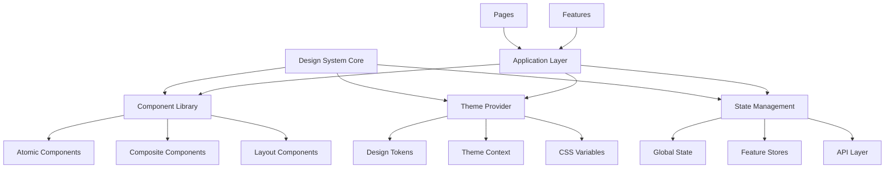
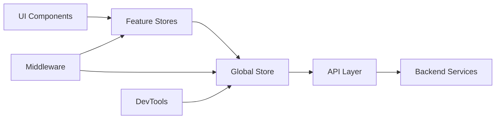

# Frontend Design System Design Document

## Overview

The JobHub Frontend Design System will transform the current monolithic React application into a scalable, maintainable architecture built around reusable components, centralized state management, and consistent design patterns. The system addresses critical issues identified in the current codebase: prop drilling, inconsistent styling, navigation complexity, and lack of component reusability.

The design system will establish a foundation for enterprise-scale growth while maintaining the existing user experience and functionality. It will provide developers with a comprehensive toolkit of components, patterns, and utilities that ensure consistency and accelerate development velocity.

## Architecture

### High-Level Architecture



### Component Architecture

The system follows atomic design principles with five distinct levels:

1. **Design Tokens** - Atomic design values (colors, spacing, typography)
2. **Atoms** - Basic building blocks (Button, Input, Icon)
3. **Molecules** - Simple component combinations (SearchBox, Card)
4. **Organisms** - Complex component groups (Header, JobCard, Dashboard)
5. **Templates** - Page-level layouts and structures
6. **Pages** - Complete user interfaces

### State Management Architecture



## Components and Interfaces

### Core Component Library Structure

```typescript
// Core component interfaces
interface BaseComponentProps {
  className?: string;
  testId?: string;
  children?: React.ReactNode;
}

interface ThemeableProps {
  variant?: 'primary' | 'secondary' | 'success' | 'warning' | 'error';
  size?: 'xs' | 'sm' | 'md' | 'lg' | 'xl';
}

interface InteractiveProps {
  disabled?: boolean;
  loading?: boolean;
  onClick?: (event: React.MouseEvent) => void;
}
```

### Component Categories

#### 1. Foundation Components
- **Button**: Primary interaction element with variants and states
- **Input**: Form input with validation and accessibility
- **Typography**: Heading, Text, Caption components
- **Icon**: Standardized icon system with consistent sizing
- **Spinner**: Loading states with size variants

#### 2. Layout Components
- **Container**: Responsive content wrapper
- **Grid**: Flexible grid system
- **Stack**: Vertical and horizontal spacing
- **Card**: Content container with elevation
- **Modal**: Overlay dialogs and popups

#### 3. Navigation Components
- **Header**: Global navigation with authentication states
- **Sidebar**: Contextual navigation for dashboards
- **Breadcrumb**: Hierarchical navigation
- **Tabs**: Content organization
- **Pagination**: Data navigation

#### 4. Form Components
- **FormField**: Complete form field with label and validation
- **Select**: Dropdown selection with search
- **Checkbox**: Boolean input with indeterminate state
- **RadioGroup**: Single selection from options
- **FileUpload**: File selection with drag-and-drop

#### 5. Data Display Components
- **Table**: Sortable, filterable data tables
- **JobCard**: Job listing display
- **UserCard**: User profile display
- **Stats**: Metric display with trends
- **Badge**: Status and category indicators

#### 6. Feedback Components
- **Toast**: Temporary notifications
- **Alert**: Persistent messages
- **ErrorBoundary**: Error handling wrapper
- **EmptyState**: No data scenarios
- **ProgressBar**: Task completion indicators

### Component API Design

```typescript
// Example: Button component interface
interface ButtonProps extends BaseComponentProps, ThemeableProps, InteractiveProps {
  variant?: 'solid' | 'outline' | 'ghost' | 'link';
  size?: 'xs' | 'sm' | 'md' | 'lg';
  fullWidth?: boolean;
  leftIcon?: React.ReactElement;
  rightIcon?: React.ReactElement;
  type?: 'button' | 'submit' | 'reset';
}

// Example: JobCard component interface
interface JobCardProps extends BaseComponentProps {
  job: Job;
  onApply?: (job: Job) => void;
  onSave?: (job: Job) => void;
  onViewDetails?: (job: Job) => void;
  isSaved?: boolean;
  showCompanyLogo?: boolean;
  compact?: boolean;
}
```

## Data Models

### Theme System Data Models

```typescript
interface DesignTokens {
  colors: {
    primary: ColorScale;
    secondary: ColorScale;
    neutral: ColorScale;
    success: ColorScale;
    warning: ColorScale;
    error: ColorScale;
  };
  typography: {
    fontFamily: {
      sans: string;
      mono: string;
    };
    fontSize: Record<string, string>;
    fontWeight: Record<string, number>;
    lineHeight: Record<string, number>;
  };
  spacing: Record<string, string>;
  borderRadius: Record<string, string>;
  shadows: Record<string, string>;
  breakpoints: Record<string, string>;
}

interface ThemeConfig {
  tokens: DesignTokens;
  mode: 'light' | 'dark' | 'system';
  customizations?: Partial<DesignTokens>;
}
```

### State Management Data Models

```typescript
interface AppState {
  auth: AuthState;
  user: UserState;
  jobs: JobsState;
  ui: UIState;
  notifications: NotificationState;
}

interface AuthState {
  isAuthenticated: boolean;
  user: User | null;
  userType: 'job_seeker' | 'employer' | 'admin' | null;
  loading: boolean;
  error: string | null;
}

interface UIState {
  theme: 'light' | 'dark' | 'system';
  sidebarOpen: boolean;
  modals: Record<string, boolean>;
  loading: Record<string, boolean>;
  errors: Record<string, string>;
}
```

### Navigation Data Models

```typescript
interface NavigationItem {
  id: string;
  label: string;
  path: string;
  icon?: React.ReactElement;
  badge?: string | number;
  children?: NavigationItem[];
  permissions?: string[];
}

interface BreadcrumbItem {
  label: string;
  path?: string;
  current?: boolean;
}

interface RouteConfig {
  path: string;
  component: React.ComponentType;
  layout?: React.ComponentType;
  guards?: Array<(user: User | null) => boolean>;
  meta?: {
    title: string;
    description?: string;
    requiresAuth?: boolean;
  };
}
```

## Correctness Properties

*A property is a characteristic or behavior that should hold true across all valid executions of a system-essentially, a formal statement about what the system should do. Properties serve as the bridge between human-readable specifications and machine-verifiable correctness guarantees.*

### Component Library Properties

**Property 1: Component API Consistency**
*For any* component in the design system, all props should conform to the standardized interface patterns defined in the component library
**Validates: Requirements 1.1**

**Property 2: Visual Consistency Across Contexts**
*For any* component rendered in different page contexts, the visual styling and behavior should remain consistent
**Validates: Requirements 1.2**

**Property 3: Design Token Compliance**
*For any* component style declaration, only approved design tokens from the theme system should be used
**Validates: Requirements 1.3**

**Property 4: Backward Compatibility Preservation**
*For any* component API update, existing prop interfaces should remain compatible with previous versions
**Validates: Requirements 1.4**

**Property 5: Documentation Completeness**
*For any* component in the library, corresponding documentation with usage examples should exist
**Validates: Requirements 1.5**

### Navigation System Properties

**Property 6: Navigation Layout Consistency**
*For any* page navigation, the layout and menu structure should remain consistent across all page contexts
**Validates: Requirements 2.1**

**Property 7: Context Preservation During Navigation**
*For any* page transition, user context and application state should be maintained with appropriate visual feedback
**Validates: Requirements 2.2**

**Property 8: Active Navigation Indication**
*For any* navigation state, the current location should be properly highlighted and available paths should be clear
**Validates: Requirements 2.3**

**Property 9: URL and History Synchronization**
*For any* navigation state change, the browser URL and history should be updated appropriately
**Validates: Requirements 2.4**

**Property 10: Keyboard Navigation Accessibility**
*For any* keyboard navigation interaction, focus should move correctly through navigation elements
**Validates: Requirements 2.5**

### State Management Properties

**Property 11: State Synchronization Consistency**
*For any* application state change, all dependent components should update consistently
**Validates: Requirements 3.1**

**Property 12: Action Handling Predictability**
*For any* user action, the state management system should produce predictable state changes and side effects
**Validates: Requirements 3.2**

**Property 13: Data Integrity Under Concurrency**
*For any* concurrent state updates, data integrity should be maintained without race conditions
**Validates: Requirements 3.3**

**Property 14: State Inspection Accuracy**
*For any* debugging session, state inspection tools should provide accurate representation of current state
**Validates: Requirements 3.4**

**Property 15: Subscription Cleanup**
*For any* component unmounting, all state subscriptions should be cleaned up to prevent memory leaks
**Validates: Requirements 3.5**

### Responsive Design Properties

**Property 16: Layout Adaptation Across Screen Sizes**
*For any* viewport size change, component layouts should adapt appropriately to maintain usability
**Validates: Requirements 4.1**

**Property 17: Touch Target Accessibility**
*For any* interactive element on touch devices, touch targets should meet minimum size requirements and support appropriate gestures
**Validates: Requirements 4.2**

**Property 18: Content Readability Across Breakpoints**
*For any* content display, text should remain readable and interactive elements should remain usable at all breakpoints
**Validates: Requirements 4.3**

**Property 19: Media Optimization for Device Capabilities**
*For any* media content, appropriate formats should be served based on device capabilities and network conditions
**Validates: Requirements 4.4**

**Property 20: Smooth Orientation Handling**
*For any* mobile device orientation change, layouts should adapt smoothly without content loss
**Validates: Requirements 4.5**

### Accessibility Properties

**Property 21: Screen Reader Compatibility**
*For any* component, proper ARIA attributes and semantic markup should be present for screen reader compatibility
**Validates: Requirements 5.1**

**Property 22: Keyboard Navigation Completeness**
*For any* interactive element, it should be reachable and usable via keyboard navigation
**Validates: Requirements 5.2**

**Property 23: Color Contrast Compliance**
*For any* color combination used in the interface, WCAG contrast requirements should be met
**Validates: Requirements 5.3**

**Property 24: Form Accessibility Standards**
*For any* form element, proper labels, error messages, and validation feedback should be provided
**Validates: Requirements 5.4**

**Property 25: Dynamic Content Announcements**
*For any* dynamic content update, changes should be announced to assistive technologies via ARIA live regions
**Validates: Requirements 5.5**

### Theme System Properties

**Property 26: Design Token Usage Enforcement**
*For any* design element, only standardized design tokens should be used for colors, typography, and spacing
**Validates: Requirements 6.1**

**Property 27: Theme Consistency Maintenance**
*For any* theme application, visual hierarchy and brand identity should remain consistent
**Validates: Requirements 6.2**

**Property 28: Token Change Propagation**
*For any* design token update, changes should propagate automatically to all components using those tokens
**Validates: Requirements 6.3**

**Property 29: Dark Mode Theme Switching**
*For any* dark mode toggle, all components should switch to appropriate dark theme variants
**Validates: Requirements 6.4**

**Property 30: Theme Customization Support**
*For any* custom theme requirement, the system should support theme extensions and overrides
**Validates: Requirements 6.5**

### Testing System Properties

**Property 31: Testing Utility Availability**
*For any* component type, appropriate testing utilities should be available for unit testing
**Validates: Requirements 7.1**

**Property 32: Integration Testing Support**
*For any* component combination, integration testing should be supported
**Validates: Requirements 7.2**

**Property 33: Visual Regression Detection**
*For any* visual change, snapshot testing should detect regressions
**Validates: Requirements 7.3**

**Property 34: Automated Accessibility Validation**
*For any* accessibility violation, automated testing should detect WCAG compliance issues
**Validates: Requirements 7.4**

**Property 35: Performance Monitoring**
*For any* component render or bundle creation, performance metrics should be collected and monitored
**Validates: Requirements 7.5**

### Documentation and Development Properties

**Property 36: Interactive Documentation Completeness**
*For any* component, interactive examples and API references should be available in documentation
**Validates: Requirements 8.1**

**Property 37: Design Pattern Documentation**
*For any* design decision, patterns, guidelines, and best practices should be documented
**Validates: Requirements 8.2**

**Property 38: Development Tool Functionality**
*For any* development session, hot reloading, error boundaries, and debugging utilities should work correctly
**Validates: Requirements 8.3**

**Property 39: Code Quality Enforcement**
*For any* code submission, linting, formatting, and type checking should catch violations
**Validates: Requirements 8.4**

**Property 40: Build Optimization**
*For any* build creation, bundles should be optimized and performance metrics should be provided
**Validates: Requirements 8.5**

## Error Handling

### Component Error Boundaries

The design system will implement comprehensive error handling at multiple levels:

1. **Component-Level Error Boundaries**: Each major component will have error boundaries to prevent cascading failures
2. **Feature-Level Error Boundaries**: Dashboard sections and major features will have isolated error handling
3. **Global Error Boundary**: Application-level error handling with user-friendly fallbacks
4. **Development Error Reporting**: Enhanced error messages and stack traces in development mode

### Error Recovery Strategies

```typescript
interface ErrorRecoveryConfig {
  retryAttempts: number;
  fallbackComponent?: React.ComponentType;
  onError?: (error: Error, errorInfo: React.ErrorInfo) => void;
  resetKeys?: string[];
}

interface ErrorState {
  hasError: boolean;
  error: Error | null;
  errorBoundary: string;
  timestamp: number;
  userAgent: string;
}
```

### State Management Error Handling

- **Action Error Handling**: All state actions will include error handling with user feedback
- **API Error Handling**: Centralized error handling for API calls with retry logic
- **Optimistic Updates**: Rollback mechanisms for failed optimistic updates
- **Error Persistence**: Error state persistence across page refreshes

## Testing Strategy

### Dual Testing Approach

The design system will implement both unit testing and property-based testing approaches:

**Unit Testing**:
- Component behavior verification
- User interaction testing
- Integration testing between components
- Accessibility compliance testing
- Visual regression testing

**Property-Based Testing**:
- Universal properties verification across all inputs
- Component API consistency testing
- Theme system compliance testing
- State management correctness testing
- Navigation behavior testing

### Testing Framework Selection

**Primary Testing Framework**: Jest with React Testing Library
- Comprehensive component testing utilities
- Accessibility testing support
- Snapshot testing capabilities
- Mock and spy functionality

**Property-Based Testing Library**: fast-check
- TypeScript-first property testing
- Rich generator ecosystem
- Shrinking capabilities for minimal failing examples
- Integration with Jest

**Visual Testing**: Chromatic
- Visual regression detection
- Cross-browser testing
- Component story validation
- Design system documentation

### Testing Configuration

```typescript
// Property-based test configuration
const PBT_CONFIG = {
  numRuns: 100, // Minimum 100 iterations per property
  timeout: 5000,
  seed: 42,
  path: "test-results",
  verbose: true
};

// Each property-based test must include this comment format:
// **Feature: frontend-design-system, Property {number}: {property_text}**
```

### Test Categories

1. **Component Unit Tests**
   - Props validation and default values
   - Event handler execution
   - Conditional rendering logic
   - Accessibility attributes

2. **Integration Tests**
   - Component composition behavior
   - State management integration
   - Theme provider integration
   - Navigation flow testing

3. **Property-Based Tests**
   - Component API consistency across all prop combinations
   - Theme token compliance across all components
   - Responsive behavior across all viewport sizes
   - Accessibility compliance across all component states

4. **Visual Regression Tests**
   - Component appearance consistency
   - Theme switching visual validation
   - Responsive layout validation
   - Cross-browser compatibility

5. **Performance Tests**
   - Component render time monitoring
   - Bundle size optimization validation
   - Memory leak detection
   - State update performance

### Accessibility Testing

- **Automated WCAG Compliance**: axe-core integration for automated accessibility testing
- **Keyboard Navigation Testing**: Comprehensive keyboard interaction testing
- **Screen Reader Testing**: ARIA attribute and semantic markup validation
- **Color Contrast Testing**: Automated color contrast ratio validation
- **Focus Management Testing**: Focus trap and focus restoration testing

The testing strategy ensures comprehensive coverage while maintaining development velocity through automated testing pipelines and clear testing guidelines for developers.