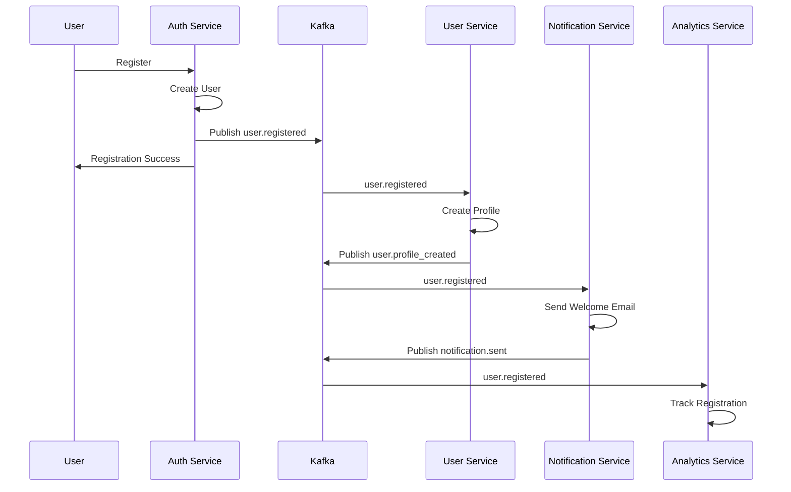
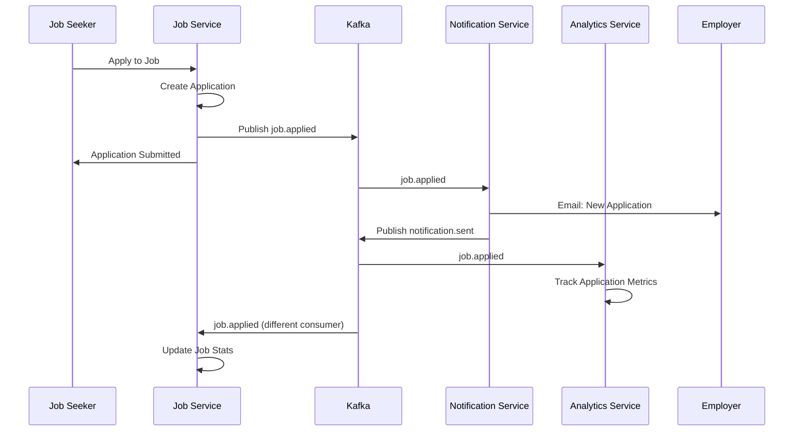

# JobHub - Event-Driven Architecture Design

## 🔄 **Event-Driven Architecture Overview**

### **Why Event-Driven Architecture?**
- **Loose Coupling**: Services communicate through events, not direct API calls
- **Scalability**: Asynchronous processing handles high loads
- **Resilience**: System continues working even if some services are down
- **Auditability**: Complete event history for compliance and debugging
- **Real-time Features**: Instant notifications and updates

### **Apache Kafka as Event Backbone**
```yaml
Kafka Cluster Configuration:
- Brokers: 3 (minimum for production)
- Replication Factor: 3
- Partitions: Based on expected throughput
- Retention: 7 days (configurable per topic)
- Compression: snappy
- Security: SASL/SSL encryption
```

## 📋 **Event Categories & Topics**

### **1. User Domain Events**
```yaml
Topic: user.events
Partitions: 12 (partition by user_id)
Retention: 30 days

Event Types:
- user.registered
- user.email_verified
- user.profile_updated
- user.skill_added
- user.experience_added
- user.resume_uploaded
- user.assessment_completed
- user.connection_requested
- user.connection_accepted
- user.deactivated
```

### **2. Job Domain Events**
```yaml
Topic: job.events
Partitions: 8 (partition by job_id)
Retention: 90 days

Event Types:
- job.created
- job.published
- job.updated
- job.paused
- job.closed
- job.expired
- job.viewed
- job.saved
- job.applied
- job.application_status_changed
```

### **3. Company Domain Events**
```yaml
Topic: company.events
Partitions: 4 (partition by company_id)
Retention: 365 days

Event Types:
- company.created
- company.profile_updated
- company.verified
- company.review_added
- company.photo_uploaded
- company.employee_added
```

### **4. Messaging Domain Events**
```yaml
Topic: messaging.events
Partitions: 16 (partition by conversation_id)
Retention: 7 days

Event Types:
- conversation.created
- message.sent
- message.read
- message.edited
- message.deleted
- file.uploaded
```

### **5. Notification Events**
```yaml
Topic: notification.events
Partitions: 8 (partition by user_id)
Retention: 3 days

Event Types:
- notification.email_requested
- notification.push_requested
- notification.sms_requested
- notification.sent
- notification.failed
- notification.opened
```

### **6. Analytics Events**
```yaml
Topic: analytics.events
Partitions: 20 (partition by user_id or session_id)
Retention: 365 days

Event Types:
- page.viewed
- job.searched
- job.clicked
- application.started
- application.completed
- profile.viewed
- skill_assessment.started
- skill_assessment.completed
```

### **7. Payment Events**
```yaml
Topic: payment.events
Partitions: 4 (partition by user_id)
Retention: 2555 days (7 years for compliance)

Event Types:
- subscription.created
- subscription.renewed
- subscription.cancelled
- payment.processed
- payment.failed
- refund.processed
```

### **8. Audit Events**
```yaml
Topic: audit.events
Partitions: 8 (partition by user_id)
Retention: 2555 days (7 years for compliance)

Event Types:
- security.login_attempt
- security.login_success
- security.login_failed
- security.password_changed
- security.mfa_enabled
- admin.user_suspended
- admin.job_moderated
- data.exported
- data.deleted
```

## 📝 **Event Schema Design**

### **Base Event Schema**
```json
{
  "eventId": "evt_01H8EXAMPLE123",
  "eventType": "user.registered",
  "eventVersion": "1.0",
  "aggregateId": "user-123-456-789",
  "aggregateType": "User",
  "correlationId": "corr_01H8EXAMPLE456",
  "causationId": "cause_01H8EXAMPLE789",
  "userId": "user-123-456-789",
  "timestamp": "2024-01-15T10:30:00.123Z",
  "source": "user-service",
  "data": {
    // Event-specific payload
  },
  "metadata": {
    "traceId": "trace_01H8EXAMPLE012",
    "spanId": "span_01H8EXAMPLE345",
    "userAgent": "JobHub-Web/1.0",
    "ipAddress": "192.168.1.100"
  }
}
```

### **User Registration Event**
```json
{
  "eventId": "evt_01H8USER001",
  "eventType": "user.registered",
  "eventVersion": "1.0",
  "aggregateId": "user-123-456-789",
  "aggregateType": "User",
  "correlationId": "corr_registration_001",
  "causationId": null,
  "userId": "user-123-456-789",
  "timestamp": "2024-01-15T10:30:00.123Z",
  "source": "auth-service",
  "data": {
    "firstName": "John",
    "lastName": "Doe",
    "email": "john.doe@example.com",
    "userType": "job_seeker",
    "emailVerified": false,
    "registrationSource": "web",
    "marketingConsent": false
  },
  "metadata": {
    "traceId": "trace_registration_001",
    "userAgent": "Mozilla/5.0...",
    "ipAddress": "192.168.1.100",
    "country": "US",
    "city": "San Francisco"
  }
}
```

### **Job Application Event**
```json
{
  "eventId": "evt_01H8JOB001",
  "eventType": "job.applied",
  "eventVersion": "1.0",
  "aggregateId": "job-789-012-345",
  "aggregateType": "Job",
  "correlationId": "corr_application_001",
  "causationId": "evt_01H8USER002",
  "userId": "user-123-456-789",
  "timestamp": "2024-01-15T14:45:00.456Z",
  "source": "job-service",
  "data": {
    "jobId": "job-789-012-345",
    "applicantId": "user-123-456-789",
    "applicationId": "app-456-789-012",
    "resumeId": "resume-123-456",
    "coverLetter": "I am excited to apply...",
    "screeningAnswers": [
      {
        "questionId": "q1",
        "answer": "5+ years"
      }
    ],
    "source": "job_search",
    "employerId": "user-employer-001"
  },
  "metadata": {
    "traceId": "trace_application_001",
    "jobTitle": "Senior Frontend Developer",
    "companyName": "Tech Corp"
  }
}
```

### **Message Sent Event**
```json
{
  "eventId": "evt_01H8MSG001",
  "eventType": "message.sent",
  "eventVersion": "1.0",
  "aggregateId": "conv-123-456-789",
  "aggregateType": "Conversation",
  "correlationId": "corr_message_001",
  "causationId": "evt_01H8JOB001",
  "userId": "user-employer-001",
  "timestamp": "2024-01-15T15:00:00.789Z",
  "source": "messaging-service",
  "data": {
    "conversationId": "conv-123-456-789",
    "messageId": "msg-789-012-345",
    "senderId": "user-employer-001",
    "recipientIds": ["user-123-456-789"],
    "content": "Thank you for your application!",
    "messageType": "text",
    "conversationType": "direct"
  },
  "metadata": {
    "traceId": "trace_message_001",
    "encrypted": true
  }
}
```

## 🔄 **Event Processing Patterns**

### **1. Event Sourcing Pattern**
```java
@Entity
public class JobAggregate {
    private UUID id;
    private List<DomainEvent> uncommittedEvents = new ArrayList<>();
    
    public void apply(JobCreatedEvent event) {
        this.id = event.getJobId();
        this.title = event.getTitle();
        this.status = JobStatus.DRAFT;
        // Apply event to aggregate state
    }
    
    public void publish() {
        this.status = JobStatus.PUBLISHED;
        this.publishedAt = Instant.now();
        
        // Record event
        JobPublishedEvent event = new JobPublishedEvent(
            this.id, this.title, this.employerId, this.publishedAt
        );
        uncommittedEvents.add(event);
    }
    
    public List<DomainEvent> getUncommittedEvents() {
        return new ArrayList<>(uncommittedEvents);
    }
    
    public void markEventsAsCommitted() {
        uncommittedEvents.clear();
    }
}
```

### **2. Saga Pattern for Distributed Transactions**
```java
@Component
public class JobApplicationSaga {
    
    @SagaOrchestrationStart
    @KafkaListener(topics = "job.events", 
                   groupId = "job-application-saga")
    public void handle(JobAppliedEvent event) {
        
        SagaTransaction saga = SagaTransaction.builder()
            .correlationId(event.getCorrelationId())
            .build();
            
        // Step 1: Validate application
        saga.addStep(new ValidateApplicationStep(event));
        
        // Step 2: Send notification to employer
        saga.addStep(new NotifyEmployerStep(event));
        
        // Step 3: Update analytics
        saga.addStep(new UpdateAnalyticsStep(event));
        
        // Step 4: Send confirmation to applicant
        saga.addStep(new ConfirmApplicationStep(event));
        
        sagaManager.execute(saga);
    }
    
    @SagaCompensation
    public void compensate(JobApplicationFailedEvent event) {
        // Rollback steps in reverse order
        sagaManager.compensate(event.getCorrelationId());
    }
}
```

### **3. CQRS (Command Query Responsibility Segregation)**
```java
// Command Side - Write Model
@Service
public class JobCommandService {
    
    @Autowired
    private JobRepository jobRepository;
    
    @Autowired
    private EventPublisher eventPublisher;
    
    public void createJob(CreateJobCommand command) {
        JobAggregate job = new JobAggregate();
        job.create(command);
        
        // Save aggregate
        jobRepository.save(job);
        
        // Publish events
        job.getUncommittedEvents().forEach(eventPublisher::publish);
        job.markEventsAsCommitted();
    }
}

// Query Side - Read Model
@Service
public class JobQueryService {
    
    @Autowired
    private JobReadModelRepository readModelRepository;
    
    @KafkaListener(topics = "job.events")
    public void handle(JobCreatedEvent event) {
        JobReadModel readModel = JobReadModel.builder()
            .id(event.getJobId())
            .title(event.getTitle())
            .description(event.getDescription())
            .status(event.getStatus())
            .createdAt(event.getTimestamp())
            .build();
            
        readModelRepository.save(readModel);
    }
    
    public List<JobReadModel> searchJobs(JobSearchQuery query) {
        return readModelRepository.search(query);
    }
}
```

## 🔧 **Event Processing Infrastructure**

### **Kafka Producer Configuration**
```java
@Configuration
public class KafkaProducerConfig {
    
    @Bean
    public ProducerFactory<String, Object> producerFactory() {
        Map<String, Object> props = new HashMap<>();
        props.put(ProducerConfig.BOOTSTRAP_SERVERS_CONFIG, "kafka:9092");
        props.put(ProducerConfig.KEY_SERIALIZER_CLASS_CONFIG, StringSerializer.class);
        props.put(ProducerConfig.VALUE_SERIALIZER_CLASS_CONFIG, JsonSerializer.class);
        props.put(ProducerConfig.ACKS_CONFIG, "all"); // Wait for all replicas
        props.put(ProducerConfig.RETRIES_CONFIG, 3);
        props.put(ProducerConfig.ENABLE_IDEMPOTENCE_CONFIG, true);
        props.put(ProducerConfig.COMPRESSION_TYPE_CONFIG, "snappy");
        return new DefaultKafkaProducerFactory<>(props);
    }
    
    @Bean
    public KafkaTemplate<String, Object> kafkaTemplate() {
        return new KafkaTemplate<>(producerFactory());
    }
}
```

### **Kafka Consumer Configuration**
```java
@Configuration
public class KafkaConsumerConfig {
    
    @Bean
    public ConsumerFactory<String, Object> consumerFactory() {
        Map<String, Object> props = new HashMap<>();
        props.put(ConsumerConfig.BOOTSTRAP_SERVERS_CONFIG, "kafka:9092");
        props.put(ConsumerConfig.GROUP_ID_CONFIG, "jobhub-service");
        props.put(ConsumerConfig.KEY_DESERIALIZER_CLASS_CONFIG, StringDeserializer.class);
        props.put(ConsumerConfig.VALUE_DESERIALIZER_CLASS_CONFIG, JsonDeserializer.class);
        props.put(ConsumerConfig.AUTO_OFFSET_RESET_CONFIG, "earliest");
        props.put(ConsumerConfig.ENABLE_AUTO_COMMIT_CONFIG, false); // Manual commit
        props.put(JsonDeserializer.TRUSTED_PACKAGES, "com.jobhub.events");
        return new DefaultKafkaConsumerFactory<>(props);
    }
}
```

### **Event Publisher Service**
```java
@Service
public class EventPublisher {
    
    @Autowired
    private KafkaTemplate<String, Object> kafkaTemplate;
    
    @Autowired
    private OutboxEventRepository outboxRepository;
    
    @Transactional
    public void publish(DomainEvent event) {
        // Store in outbox for reliability
        OutboxEvent outboxEvent = OutboxEvent.builder()
            .aggregateId(event.getAggregateId())
            .eventType(event.getEventType())
            .eventData(event.getData())
            .correlationId(event.getCorrelationId())
            .build();
            
        outboxRepository.save(outboxEvent);
    }
    
    @Scheduled(fixedDelay = 5000) // Every 5 seconds
    public void publishOutboxEvents() {
        List<OutboxEvent> unpublishedEvents = outboxRepository
            .findByProcessedAtIsNull();
            
        for (OutboxEvent outboxEvent : unpublishedEvents) {
            try {
                String topic = getTopicForEventType(outboxEvent.getEventType());
                String key = outboxEvent.getAggregateId().toString();
                
                kafkaTemplate.send(topic, key, outboxEvent.getEventData())
                    .addCallback(
                        result -> markAsProcessed(outboxEvent),
                        failure -> handlePublishFailure(outboxEvent, failure)
                    );
                    
            } catch (Exception e) {
                handlePublishFailure(outboxEvent, e);
            }
        }
    }
}
```

## 📊 **Event Processing Workflows**

### **User Registration Workflow**


### **Job Application Workflow**


## 🔍 **Event Monitoring & Observability**

### **Event Metrics to Track**
```yaml
Producer Metrics:
- Events published per second
- Publishing latency (p95, p99)
- Failed publishes
- Retry attempts

Consumer Metrics:
- Events consumed per second
- Processing latency
- Consumer lag
- Failed processing attempts
- Dead letter queue size

Business Metrics:
- User registrations per hour
- Job applications per day
- Message volume
- Notification delivery rates
```

### **Event Tracing**
```java
@Component
public class EventTracer {
    
    @EventListener
    public void traceEvent(DomainEvent event) {
        Span span = tracer.nextSpan()
            .name("event.processing")
            .tag("event.type", event.getEventType())
            .tag("aggregate.id", event.getAggregateId())
            .tag("correlation.id", event.getCorrelationId())
            .start();
            
        try (Tracer.SpanInScope ws = tracer.withSpanInScope(span)) {
            // Event processing happens here
            processEvent(event);
        } finally {
            span.end();
        }
    }
}
```

### **Dead Letter Queue Handling**
```java
@Service
public class DeadLetterQueueHandler {
    
    @KafkaListener(topics = "user.events.dlq")
    public void handleFailedUserEvents(ConsumerRecord<String, Object> record) {
        
        FailedEvent failedEvent = FailedEvent.builder()
            .originalTopic(record.topic())
            .eventData(record.value())
            .failureReason("Processing failed")
            .retryCount(0)
            .maxRetries(3)
            .nextRetryAt(Instant.now().plus(Duration.ofMinutes(5)))
            .build();
            
        failedEventRepository.save(failedEvent);
    }
    
    @Scheduled(fixedDelay = 60000) // Every minute
    public void retryFailedEvents() {
        List<FailedEvent> eventsToRetry = failedEventRepository
            .findByNextRetryAtBeforeAndRetryCountLessThan(
                Instant.now(), 3
            );
            
        for (FailedEvent failedEvent : eventsToRetry) {
            try {
                // Retry processing
                eventProcessor.process(failedEvent.getEventData());
                failedEventRepository.delete(failedEvent);
                
            } catch (Exception e) {
                // Increment retry count and schedule next retry
                failedEvent.incrementRetryCount();
                failedEvent.setNextRetryAt(
                    Instant.now().plus(Duration.ofMinutes(5 * failedEvent.getRetryCount()))
                );
                failedEventRepository.save(failedEvent);
            }
        }
    }
}
```

This event-driven architecture provides the foundation for a scalable, resilient, and maintainable system that can handle JobHub's complex business workflows while maintaining strong consistency where needed and eventual consistency where appropriate.